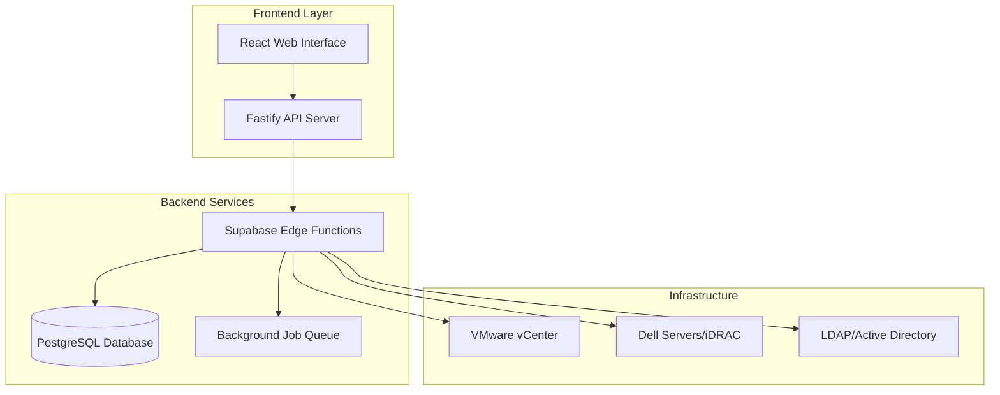

# iDRAC Updater Orchestrator

[](https://opensource.org/licenses/MIT)
[](https://nodejs.org/)
[](https://www.typescriptlang.org/)

> **Enterprise-grade Dell iDRAC firmware orchestration with VMware vCenter integration**

A comprehensive solution for orchestrating firmware updates across Dell server infrastructure with zero-downtime rolling updates, cluster-aware scheduling, and maintenance window management.

## 🚀 Quick Start

### One-Click Installation

**Linux/macOS:**
```bash
curl -fsSL https://raw.githubusercontent.com/your-org/idrac-updater-orchestrator/main/install.sh | sudo bash
```

**Windows (PowerShell as Administrator):**
```powershell
iwr -useb https://raw.githubusercontent.com/your-org/idrac-updater-orchestrator/main/scripts/install-windows.ps1 | iex
```

**RHEL 9:**
```bash
curl -fsSL https://raw.githubusercontent.com/your-org/idrac-updater-orchestrator/main/install-rhel.sh | sudo bash
```

### Docker Deployment

```bash
git clone https://github.com/your-org/idrac-updater-orchestrator.git
cd idrac-updater-orchestrator
docker-compose -f docker-compose.prod.yml up -d
```

Access the web interface at `http://localhost:3000`

## 🎯 Core Features

### 🔄 Zero-Downtime Operations
- **Cluster-Aware Rolling Updates**: Respects vSphere cluster constraints and DRS rules
- **Intelligent Sequencing**: Updates servers based on cluster topology and dependencies
- **Automatic Rollback**: Reverts changes if health checks fail during updates

### 🛡️ Enterprise Security
- **LDAP/Active Directory Integration**: Centralized user management with Red Hat IDM support
- **Role-Based Access Control (RBAC)**: Granular permissions for different operations
- **Audit Trail**: Complete logging of all operations and configuration changes
- **Credential Vault**: Secure storage of server and vCenter credentials

### 📊 Real-Time Monitoring
- **Live Dashboard**: Real-time status of all managed servers and clusters
- **Health Monitoring**: Continuous monitoring of server health and cluster status
- **Performance Metrics**: Detailed analytics on update success rates and timing
- **Alert Management**: Configurable alerts for critical events and failures

### 🔧 Flexible Firmware Management
- **Dell Catalog Integration**: Direct access to Dell's official firmware catalog
- **Custom Firmware**: Upload and deploy custom firmware packages
- **Selective Updates**: Choose specific components (BIOS, iDRAC, drivers)
- **Compliance Reporting**: Track firmware versions across your infrastructure

## 🏗️ Architecture



## 📋 System Requirements

### Minimum Requirements
- **CPU**: 2 cores
- **Memory**: 4GB RAM
- **Storage**: 20GB available space
- **OS**: Linux (Ubuntu 20.04+), macOS (10.15+), Windows Server 2019+

### Recommended for Production
- **CPU**: 4+ cores
- **Memory**: 8GB+ RAM
- **Storage**: 100GB+ SSD
- **Network**: Gigabit Ethernet
- **OS**: Linux (Ubuntu 22.04 LTS, RHEL 9)

### Network Requirements
- Access to Dell Support Site (downloads.dell.com)
- Connectivity to vCenter Server(s)
- Access to Dell iDRAC interfaces
- LDAP/AD server connectivity (if using authentication)

## 🔧 Configuration

### Initial Setup Wizard
1. **System Configuration**: Basic system settings and database setup
2. **Authentication**: Configure LDAP/AD or local authentication
3. **vCenter Integration**: Add vCenter connections and credentials
4. **Server Discovery**: Discover and inventory Dell servers
5. **Maintenance Windows**: Configure default maintenance schedules

### Advanced Configuration
- **Credential Profiles**: Manage server access credentials
- **Update Policies**: Define automated update rules and schedules
- **Notification Settings**: Configure alerts and reporting
- **Security Settings**: SSL/TLS configuration and access controls

## 📚 Documentation

| Document | Description |
|----------|-------------|
| [Architecture Guide](./ARCHITECTURE.md) | System architecture and component details |
| [API Reference](./API_REFERENCE.md) | Complete REST API documentation |
| [Development Guide](./DEVELOPMENT.md) | Setup and contribution guidelines |
| [Security Guide](./SECURITY.md) | Security best practices and configuration |
| [Troubleshooting](./TROUBLESHOOTING.md) | Common issues and solutions |

## 🛠️ Development

### Local Development Setup

**Option 1: Full Environment (Recommended)**
```bash
git clone https://github.com/your-org/idrac-updater-orchestrator.git
cd idrac-updater-orchestrator
./start-supabase-local.sh
```

**Option 2: Frontend Only**
```bash
npm install
cp .env.example .env
npm run dev
```

### Technology Stack
- **Frontend**: React 18, TypeScript, Tailwind CSS, shadcn/ui
- **Backend**: Fastify (Node.js), Supabase Edge Functions (Deno)
- **Database**: PostgreSQL with real-time subscriptions
- **Infrastructure**: Docker, PM2, Nginx

## 🤝 Contributing

We welcome contributions! Please see our [Contributing Guidelines](./CONTRIBUTING.md) for details.

1. Fork the repository
2. Create a feature branch
3. Make your changes
4. Add tests if applicable
5. Submit a pull request

## 📄 License

This project is licensed under the MIT License - see the [LICENSE](./LICENSE) file for details.

## 🆘 Support

### Community Support
- **GitHub Issues**: [Report bugs and request features](https://github.com/your-org/idrac-updater-orchestrator/issues)
- **Discussions**: [Community discussions and Q&A](https://github.com/your-org/idrac-updater-orchestrator/discussions)

### Enterprise Support
For enterprise support, custom development, or consulting services, please contact our team.

---

<div align="center">

**[Documentation](./docs/) • [API Reference](./API_REFERENCE.md) • [Quick Start](./QUICK_START.md) • [Contributing](./CONTRIBUTING.md)**

Made with ❤️ by the Enterprise Infrastructure Team

</div>