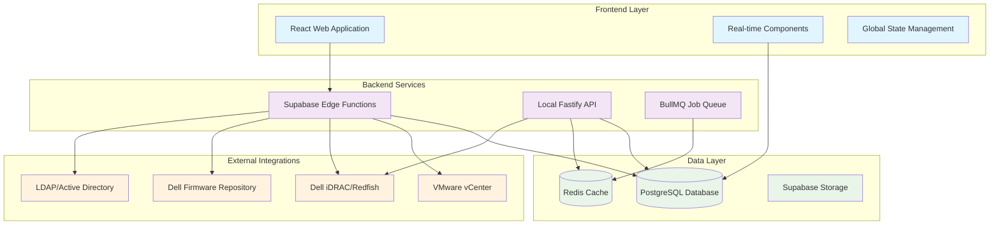
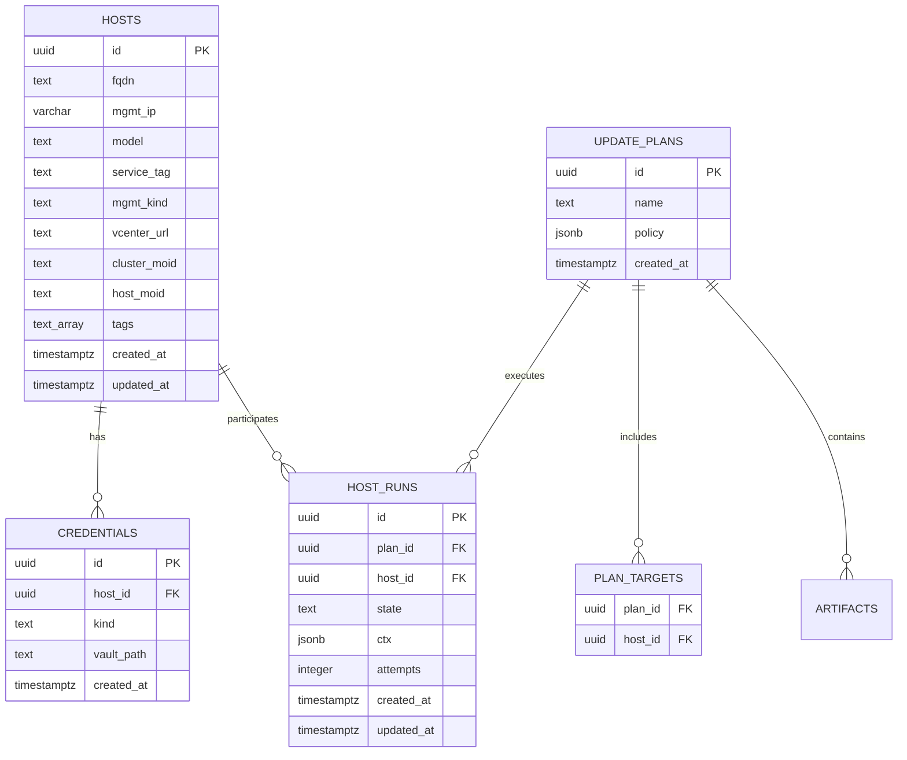

# System Architecture

## Overview

The iDRAC Updater Orchestrator is a modern, enterprise-grade web application designed for orchestrating firmware updates across Dell server infrastructure with intelligent VMware vCenter integration.

## High-Level Architecture



## Technology Stack

### Frontend Architecture
- **React 18** with TypeScript for type safety and modern React features
- **Vite** for fast development and optimized builds
- **Tailwind CSS** with custom design system and semantic tokens
- **React Router** for client-side routing
- **TanStack Query** for server state management and caching
- **Zustand/Context** for client state management
- **Radix UI** for accessible component primitives

### Backend Architecture
- **Dual Backend System**:
  - **Supabase Edge Functions** (Deno runtime) for cloud-native operations
  - **Local Fastify API** (Node.js) for on-premise integration
- **PostgreSQL** as primary database with Row Level Security
- **Redis** for caching and job queue management
- **BullMQ** for background job processing

### Integration Layer
- **Dell Redfish API** for firmware management and hardware monitoring
- **VMware vCenter REST API** for cluster orchestration
- **Dell Firmware Repository** for automated firmware discovery
- **LDAP/Active Directory** for enterprise authentication

## Core Components

### 1. Web Application (React)

```
src/
├── components/           # Reusable UI components
│   ├── dashboard/       # Dashboard widgets and layouts
│   ├── inventory/       # Server inventory management
│   ├── scheduler/       # Update scheduling interfaces
│   ├── firmware/        # Firmware management UI
│   ├── vcenter/         # vCenter integration components
│   └── ui/             # Base UI components (shadcn/ui)
├── hooks/               # Custom React hooks
├── pages/               # Route-level components
├── types/               # TypeScript type definitions
└── lib/                # Utility functions and configurations
```

### 2. Edge Functions (Supabase)

```
supabase/functions/
├── discover-servers/         # Network server discovery
├── redfish-update/          # Firmware update orchestration
├── vcenter-integration/     # vCenter API operations
├── maintenance-scheduler/   # Maintenance window management
├── workflow-engine/         # Business process orchestration
└── background-job-processor/ # Async job processing
```

### 3. Local API (Fastify)

```
api/
├── src/
│   ├── routes/          # REST API endpoints
│   ├── lib/             # Integration libraries
│   │   ├── redfish/     # Dell Redfish client
│   │   ├── vcenter/     # VMware vCenter client
│   │   ├── racadm/      # RACADM command wrapper
│   │   └── ipmi/        # IPMI integration
│   ├── orchestration/  # State machine and queue management
│   └── workers/         # Background job workers
```

#### Multi-Protocol Update Layer

The `api/src/lib/protocols` module implements a production-ready firmware transport layer with the following capabilities:

- **Protocol auto-detection** across Redfish, WS-MAN, RACADM, IPMI, and SSH with mixed-generation iDRAC awareness.
- **Health monitoring** via `ProtocolManager`, emitting structured telemetry for observability pipelines.
- **Intelligent fallback chain** (`Redfish → WS-MAN → RACADM → IPMI → SSH`) with error classification and exponential backoff retry policies.
- **Firmware operation abstraction** (`FirmwareUpdateRequest`) powering `SimpleUpdate`, `InstallFromRepository`, and `MultipartUpdate` workflows.
- **Pluggable architecture** that allows service providers to extend update transports without modifying the state machine.

The orchestration state machine consumes this layer to guarantee protocol resiliency during complex, multi-component update plans.

## Data Architecture

### Database Schema Design



### Key Design Patterns

1. **Event Sourcing**: All operations generate immutable events for audit trails
2. **State Machine**: Host update processes follow defined state transitions
3. **Hierarchical Configuration**: Credentials and policies inherit from datacenter → cluster → host
4. **Real-time Synchronization**: WebSocket connections for live status updates

## Security Architecture

### Authentication & Authorization
- **Supabase Auth** for user authentication with social providers
- **Row Level Security (RLS)** policies enforce data access control
- **Role-Based Access Control (RBAC)** for operation permissions
- **Credential Vault** for secure storage of server credentials

### Network Security
- **TLS/SSL** encryption for all API communications
- **Certificate Validation** for Redfish API connections
- **Network Segmentation** support for management interfaces
- **API Key Management** for service-to-service authentication

## Scalability & Performance

### Horizontal Scaling
- **Edge Functions** auto-scale based on demand
- **Database Connection Pooling** for efficient resource utilization
- **Redis Clustering** for distributed caching
- **CDN Integration** for static asset delivery

### Performance Optimizations
- **Query Optimization** with proper indexing strategies
- **Caching Layers** at API and database levels
- **Lazy Loading** for large datasets
- **Background Processing** for long-running operations

## Deployment Architecture

### Production Deployment Options

1. **Cloud-Native (Recommended)**
   - Supabase managed services
   - Edge Functions for serverless compute
   - Managed PostgreSQL with backups
   - Global CDN distribution

2. **On-Premise Enterprise**
   - Docker containerization
   - Kubernetes orchestration
   - Local PostgreSQL cluster
   - Redis cluster for high availability

3. **Hybrid Deployment**
   - Cloud control plane
   - On-premise data processing
   - VPN/private network connectivity
   - Data residency compliance

## Integration Patterns

### VMware vCenter Integration
- **REST API Client** with session management
- **Real-time Cluster Monitoring** via periodic sync
- **Host State Synchronization** for maintenance mode coordination
- **DRS/HA Policy Enforcement** during updates

### Dell Hardware Integration
- **Redfish API Standard** for modern server management
- **RACADM Fallback** for legacy server support
- **Firmware Compatibility Matrix** validation
- **Hardware Health Monitoring** integration

### Enterprise Directory Integration
- **LDAP Authentication** with group-based authorization
- **Active Directory** domain controller integration
- **SAML/SSO** support for federated authentication
- **User Provisioning** automation

## Monitoring & Observability

### Application Monitoring
- **Real-time Metrics** collection and visualization
- **Distributed Tracing** for request flow analysis
- **Error Tracking** with automatic alerting
- **Performance Monitoring** with SLA tracking

### Infrastructure Monitoring
- **Server Health Checks** via Redfish sensors
- **Network Connectivity** monitoring
- **Database Performance** metrics
- **Resource Utilization** tracking

### Audit & Compliance
- **Complete Audit Trail** for all operations
- **Immutable Event Log** for compliance reporting
- **Security Event Monitoring** and alerting
- **Regulatory Compliance** reporting tools