# Business Logic & Workflows

## Overview

This document details the core business processes, workflows, and decision logic that drive the iDRAC Updater Orchestrator. Understanding these workflows is essential for comprehending how the system coordinates complex server update operations while maintaining high availability.

## Core Business Concepts

### Server Lifecycle States

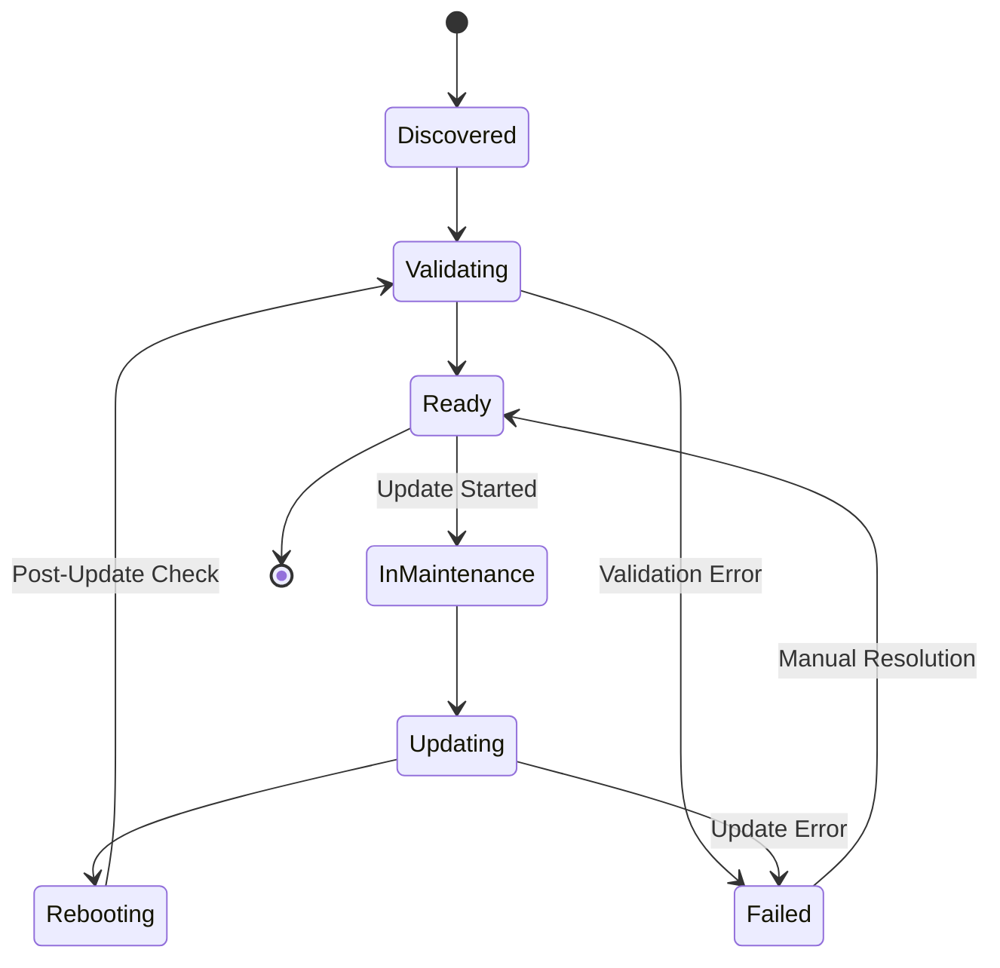

### Update Plan Lifecycle

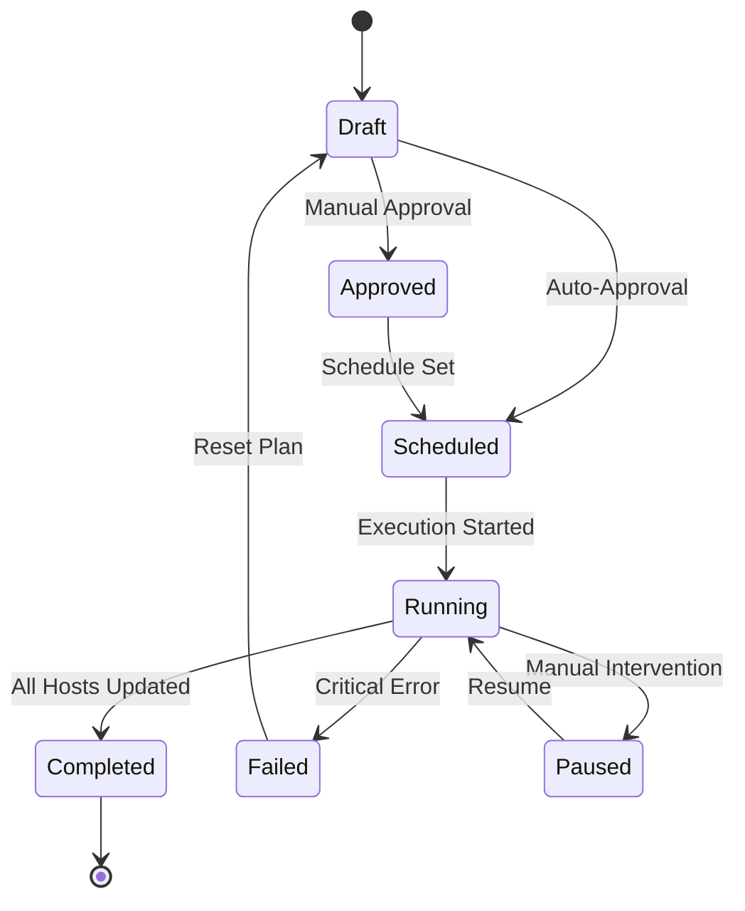

## Core Business Workflows

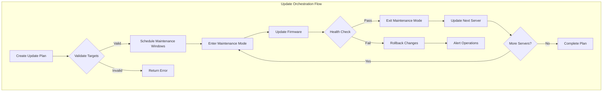

## Core Workflows

### 1. Server Discovery & Onboarding

#### Network Discovery Workflow
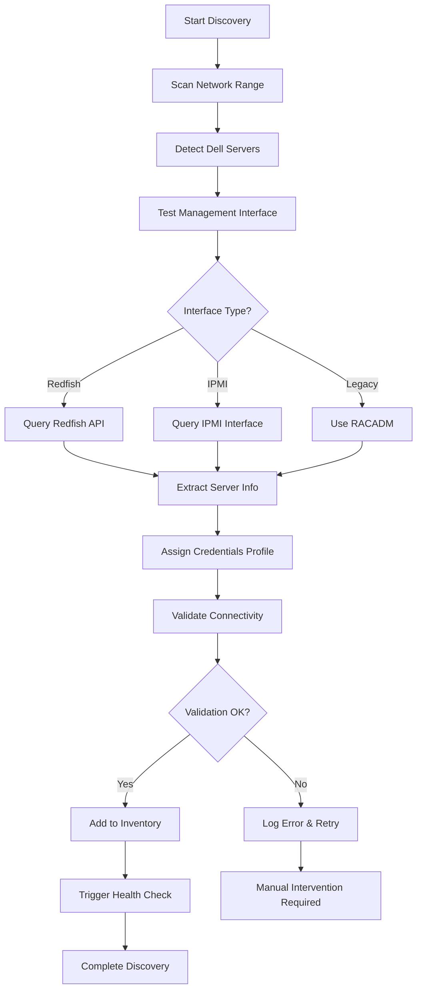

**Business Rules:**
- Only Dell servers with compatible management interfaces are added
- Credential profiles are assigned based on IP range hierarchy
- Failed validations require manual review before retry
- Discovery results are logged for audit purposes

#### vCenter Synchronization Workflow
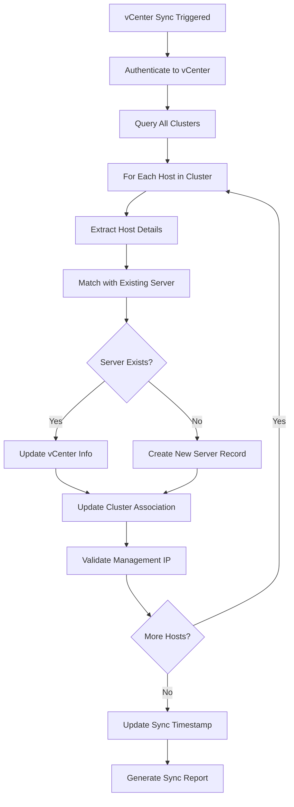

**Business Rules:**
- vCenter data takes precedence for cluster associations
- Management IP mismatches trigger alerts
- Orphaned servers (not in vCenter) are flagged
- Sync frequency is configurable per vCenter connection

### 2. Firmware Update Orchestration

#### Pre-Update Planning Phase
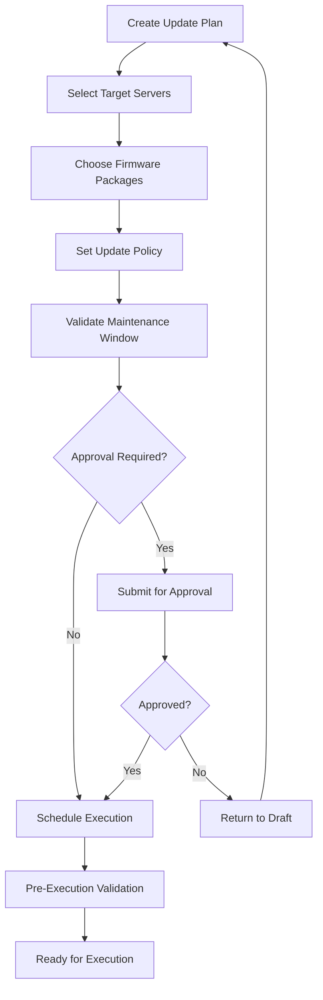

**Business Rules:**
- Maintenance windows must be validated against datacenter policies
- Firmware compatibility is verified before scheduling
- Approval workflows are configurable by organization
- Plans cannot execute outside maintenance windows (unless emergency override)

#### Update Execution Workflow
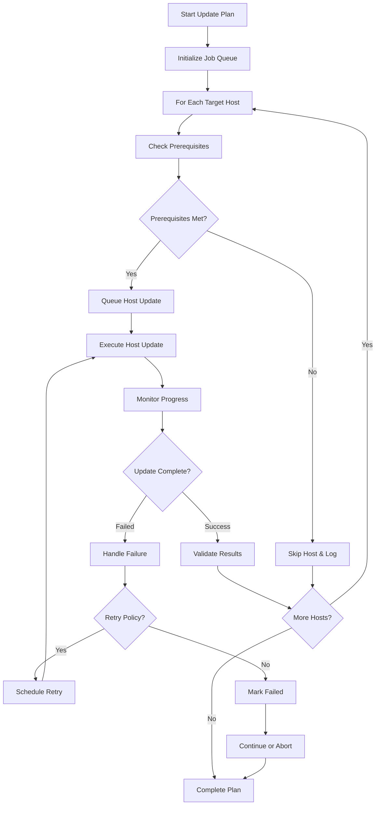

**Business Rules:**
- Cluster capacity must be maintained during updates
- Failed updates trigger configurable retry logic
- Critical failures can abort entire plans
- Real-time monitoring provides progress visibility

#### Individual Host Update Process
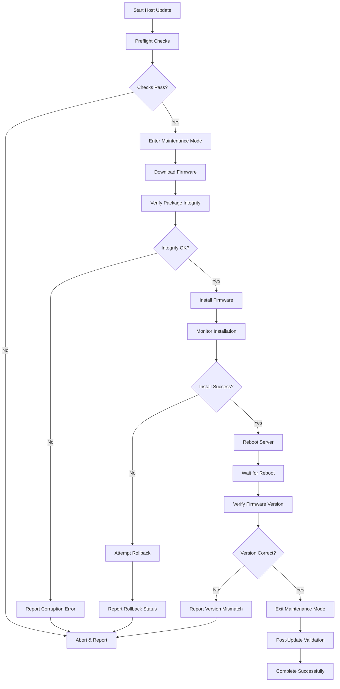

**Business Rules:**
- Preflight checks include connectivity, space, and compatibility
- Firmware integrity is verified using checksums
- Rollback is attempted for installation failures
- Post-update validation confirms system health

### 3. Cluster Orchestration Logic

#### DRS/HA Integration Workflow
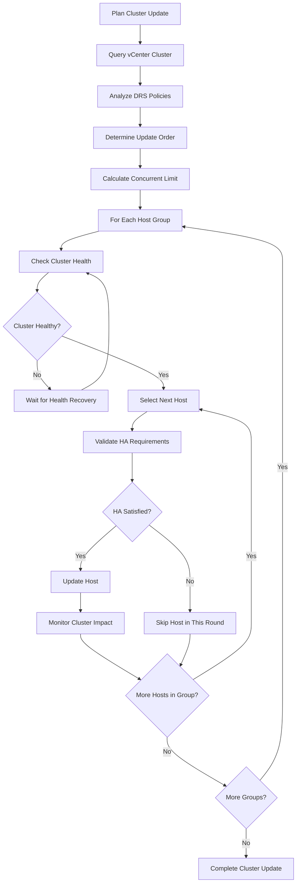

**Business Rules:**
- Minimum number of hosts must remain online
- DRS anti-affinity rules are respected
- HA capacity requirements are maintained
- Update order optimizes for workload distribution

#### Maintenance Mode Coordination
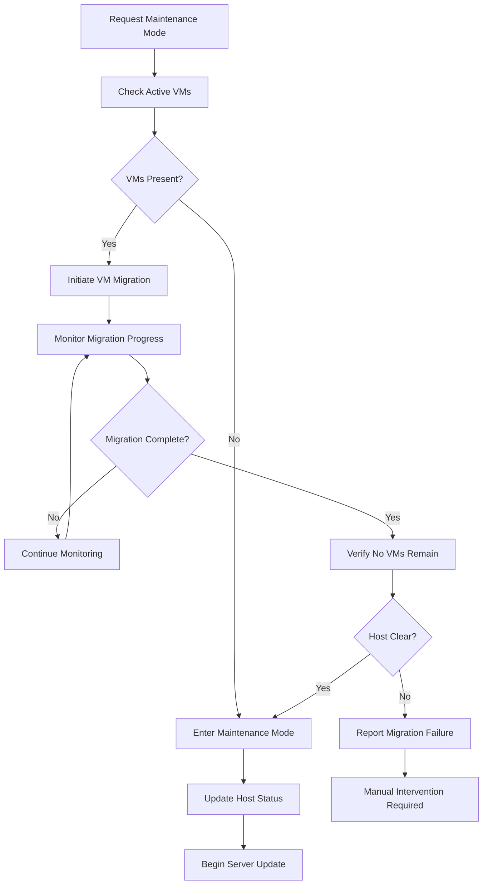

**Business Rules:**
- VMs must be migrated before maintenance mode
- Migration timeout triggers failure handling
- Host status is tracked throughout process
- Manual intervention available for complex migrations

### 4. Maintenance Window Management

#### Window Validation Logic
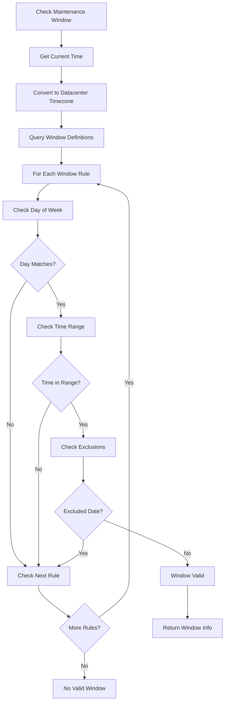

**Business Rules:**
- Timezone conversion uses datacenter location
- Multiple window definitions can overlap
- Holiday exclusions override regular schedules
- Emergency override bypasses window restrictions

#### Emergency Override Process
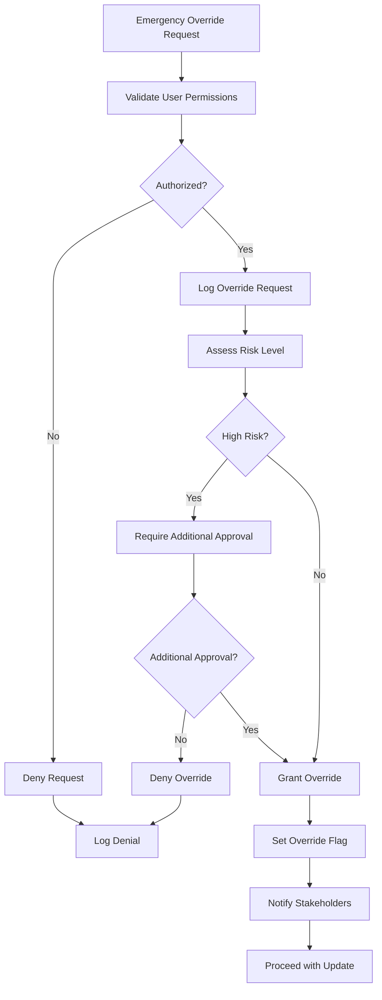

**Business Rules:**
- Only privileged users can request overrides
- High-risk overrides require multiple approvals
- All override activities are logged and audited
- Stakeholder notifications are automatic

### 5. Error Handling & Recovery

#### Failure Recovery Workflow
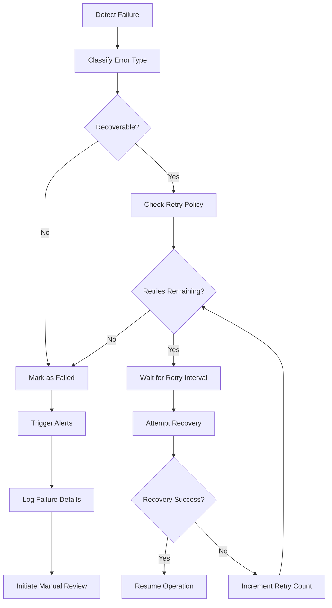

**Business Rules:**
- Error types determine recovery strategies
- Retry policies are configurable per operation type
- Failed operations require manual intervention
- All failures generate audit trail entries

#### Rollback Procedures
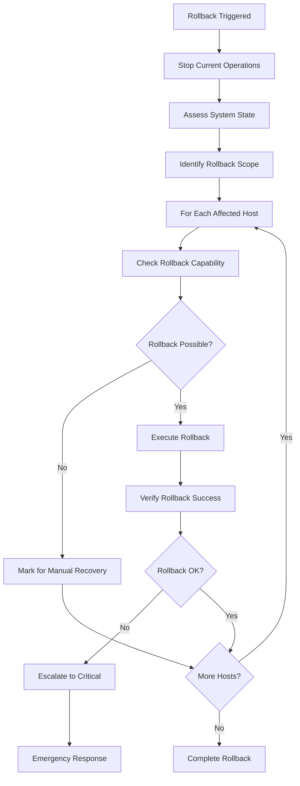

**Business Rules:**
- Rollback scope is determined by failure impact
- Not all operations support automatic rollback
- Critical failures trigger emergency procedures
- Rollback success is verified before completion

## Decision Logic Matrices

### Update Prioritization Matrix

| Server Role | Criticality | Maintenance Window | Priority Score |
|-------------|-------------|-------------------|----------------|
| Production DB | Critical | Standard | 1 (Highest) |
| Web Frontend | High | Standard | 2 |
| Development | Low | Any | 5 (Lowest) |
| Backup | Medium | Extended | 3 |

### Concurrent Update Limits

| Cluster Size | HA Level | Max Concurrent | Min Remaining |
|--------------|----------|----------------|---------------|
| 2-3 hosts | Basic | 1 | 1 |
| 4-6 hosts | Standard | 2 | 2 |
| 7-12 hosts | High | 3 | 3 |
| 13+ hosts | Enterprise | 25% | 75% |

### Retry Policy Configuration

| Error Type | Max Retries | Interval | Escalation |
|------------|-------------|----------|------------|
| Network Timeout | 3 | 5 min | Yes |
| Authentication | 1 | 1 min | Yes |
| Firmware Corruption | 0 | N/A | Immediate |
| System Busy | 5 | 2 min | No |

## Business Rules Engine

### Rule Categories

1. **Operational Rules**
   - Maintenance window enforcement
   - Cluster capacity requirements
   - Update ordering constraints
   - Resource availability checks

2. **Security Rules**
   - Credential validation requirements
   - Access control enforcement
   - Audit trail generation
   - Encryption standards

3. **Compliance Rules**
   - Regulatory requirement adherence
   - Change management integration
   - Approval workflow enforcement
   - Documentation requirements

4. **Performance Rules**
   - Concurrent operation limits
   - Resource utilization thresholds
   - Timeout configurations
   - Optimization triggers

### Rule Evaluation Process

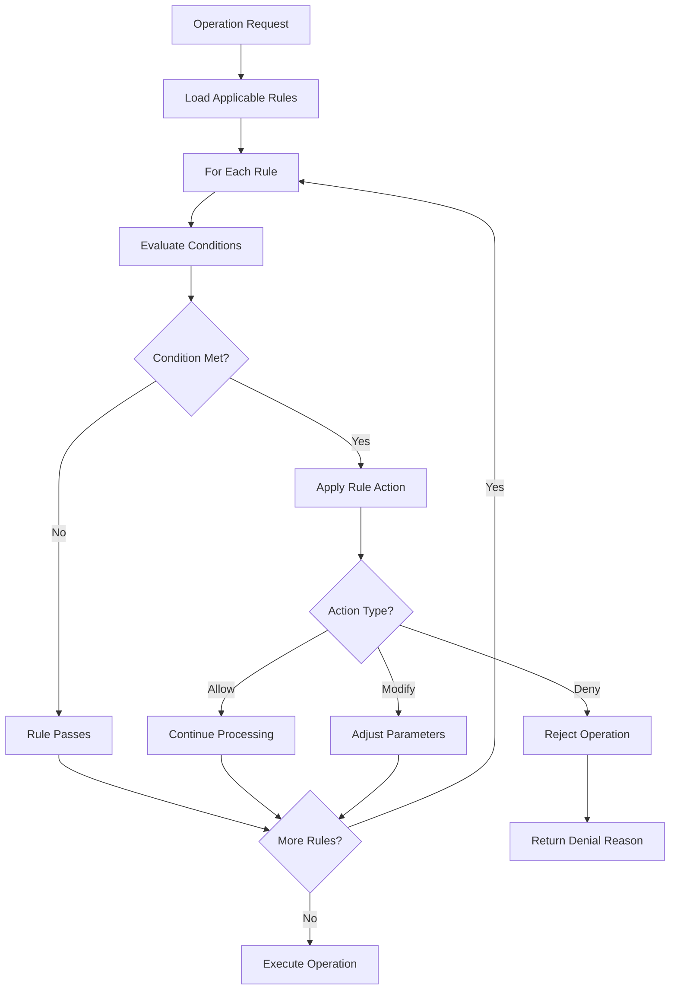

**Rule Engine Features:**
- Dynamic rule loading and evaluation
- Hierarchical rule precedence
- Context-aware rule application
- Real-time rule modification capability
- Comprehensive rule audit logging

This business logic framework ensures that all system operations align with organizational policies, technical constraints, and operational best practices while maintaining flexibility for various deployment scenarios.