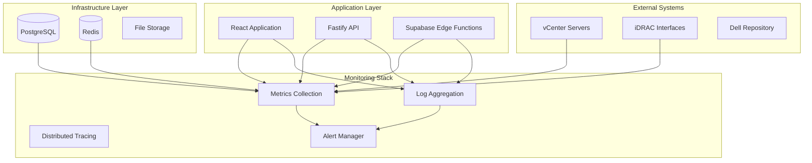
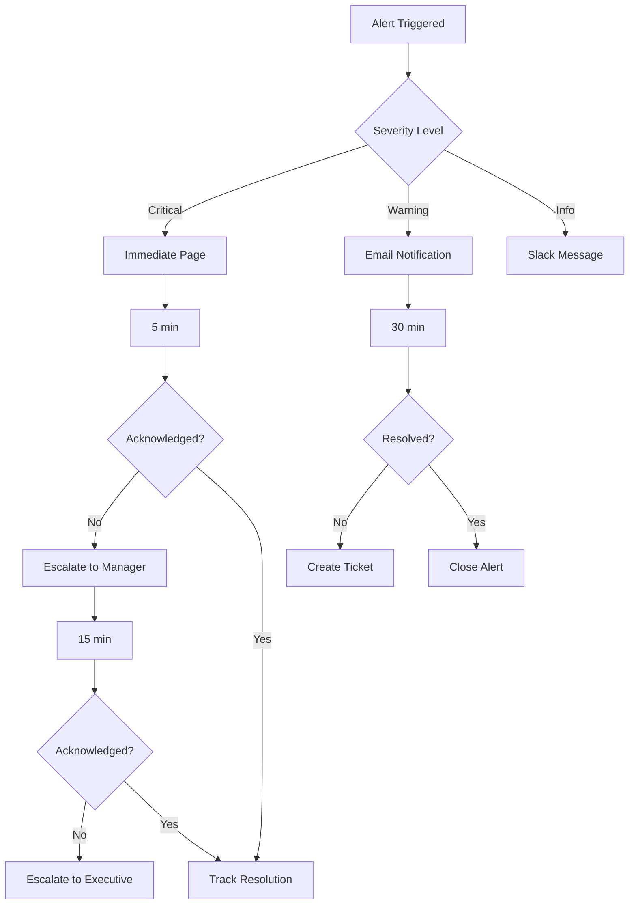

# Monitoring & Observability

## Overview

The iDRAC Updater Orchestrator implements comprehensive monitoring across application performance, infrastructure health, business metrics, and security events. This document outlines the monitoring architecture, key metrics, alerting strategies, and operational procedures.

## Monitoring Architecture



## Key Performance Indicators (KPIs)

### Application Performance
| Metric | Target | Critical Threshold | Purpose |
|--------|--------|-------------------|---------|
| Page Load Time | < 2s | > 5s | User experience |
| API Response Time | < 500ms | > 2s | API performance |
| Edge Function Duration | < 5s | > 30s | Serverless performance |
| Database Query Time | < 100ms | > 1s | Database performance |
| Error Rate | < 1% | > 5% | System reliability |

### Business Metrics
| Metric | Description | Monitoring Frequency |
|--------|-------------|---------------------|
| Update Success Rate | Percentage of successful firmware updates | Real-time |
| Time to Complete Update | Average duration for firmware updates | Per update |
| Server Discovery Rate | Servers discovered per scan | Per discovery job |
| Maintenance Window Utilization | Percentage of maintenance windows used | Daily |
| System Availability | Overall system uptime | Real-time |

### Infrastructure Health
| Component | Health Check | Frequency | Alert Threshold |
|-----------|--------------|-----------|----------------|
| Database | Connection test | 30s | Connection failure |
| Redis | Ping test | 30s | Response time > 1s |
| API Endpoints | Health check | 60s | HTTP 5xx responses |
| Edge Functions | Synthetic test | 5min | Function failure |
| External APIs | Connectivity test | 2min | Connection timeout |

## Metrics Collection

### Application Metrics

#### Frontend Metrics (React)
```typescript
/**
 * Performance monitoring for React application
 */
class ApplicationMetrics {
  private static instance: ApplicationMetrics;
  
  // Track page load times
  trackPageLoad(page: string, loadTime: number) {
    this.sendMetric('page_load_time', loadTime, { page });
  }
  
  // Track user interactions
  trackUserAction(action: string, duration?: number) {
    this.sendMetric('user_action', duration || 1, { action });
  }
  
  // Track API call performance
  trackApiCall(endpoint: string, duration: number, status: number) {
    this.sendMetric('api_call_duration', duration, { 
      endpoint, 
      status: status.toString() 
    });
  }
  
  // Track errors
  trackError(error: Error, context: string) {
    this.sendMetric('frontend_error', 1, { 
      error: error.message,
      context,
      stack: error.stack?.substring(0, 500)
    });
  }
}

// Usage in components
const metrics = ApplicationMetrics.getInstance();

useEffect(() => {
  const startTime = Date.now();
  return () => {
    metrics.trackPageLoad('dashboard', Date.now() - startTime);
  };
}, []);
```

#### Backend API Metrics (Fastify)
```typescript
/**
 * API metrics collection middleware
 */
app.register(async function metricsPlugin(fastify) {
  // Request duration tracking
  fastify.addHook('onRequest', async (request, reply) => {
    request.startTime = Date.now();
  });
  
  fastify.addHook('onResponse', async (request, reply) => {
    const duration = Date.now() - request.startTime;
    
    // Send metrics
    await sendMetric('api_request_duration', duration, {
      method: request.method,
      route: request.routerPath,
      status: reply.statusCode.toString()
    });
    
    // Track errors
    if (reply.statusCode >= 400) {
      await sendMetric('api_error', 1, {
        method: request.method,
        route: request.routerPath,
        status: reply.statusCode.toString()
      });
    }
  });
  
  // Health check endpoint
  fastify.get('/health', async (request, reply) => {
    const health = await checkSystemHealth();
    reply.code(health.status === 'healthy' ? 200 : 503).send(health);
  });
});
```

#### Edge Function Metrics (Supabase)
```typescript
/**
 * Edge function monitoring
 */
Deno.serve(async (req) => {
  const startTime = Date.now();
  
  try {
    // Function logic here
    const result = await processRequest(req);
    
    // Track success metrics
    await logMetric('edge_function_duration', Date.now() - startTime, {
      function_name: 'redfish-update',
      status: 'success'
    });
    
    return new Response(JSON.stringify(result), {
      headers: { 'Content-Type': 'application/json' }
    });
    
  } catch (error) {
    // Track error metrics
    await logMetric('edge_function_error', 1, {
      function_name: 'redfish-update',
      error: error.message
    });
    
    throw error;
  }
});
```

### Infrastructure Metrics

#### Database Monitoring
```sql
-- Performance monitoring queries
CREATE VIEW performance_metrics AS
SELECT 
  schemaname,
  tablename,
  n_tup_ins + n_tup_upd + n_tup_del as total_writes,
  n_tup_hot_upd,
  n_live_tup,
  n_dead_tup,
  last_vacuum,
  last_autovacuum,
  last_analyze,
  last_autoanalyze
FROM pg_stat_user_tables;

-- Slow query detection
CREATE OR REPLACE FUNCTION monitor_slow_queries()
RETURNS TABLE(
  query text,
  mean_exec_time numeric,
  calls bigint,
  total_exec_time numeric
) AS $$
BEGIN
  RETURN QUERY
  SELECT 
    pss.query,
    pss.mean_exec_time,
    pss.calls,
    pss.total_exec_time
  FROM pg_stat_statements pss
  WHERE pss.mean_exec_time > 1000 -- Queries taking more than 1 second
  ORDER BY pss.mean_exec_time DESC
  LIMIT 10;
END;
$$ LANGUAGE plpgsql;
```

#### System Resource Monitoring
```bash
#!/bin/bash
# System resource monitoring script

collect_system_metrics() {
  # CPU Usage
  cpu_usage=$(top -bn1 | grep "Cpu(s)" | awk '{print $2}' | awk -F'%' '{print $1}')
  
  # Memory Usage
  memory_usage=$(free | grep Mem | awk '{print ($3/$2) * 100.0}')
  
  # Disk Usage
  disk_usage=$(df -h / | awk 'NR==2 {print $5}' | tr -d '%')
  
  # Network Connections
  connections=$(netstat -an | grep ESTABLISHED | wc -l)
  
  # Send metrics
  curl -X POST "${METRICS_ENDPOINT}/system" \
    -H "Content-Type: application/json" \
    -d "{
      \"cpu_usage\": ${cpu_usage},
      \"memory_usage\": ${memory_usage},
      \"disk_usage\": ${disk_usage},
      \"connections\": ${connections},
      \"timestamp\": \"$(date -u +%Y-%m-%dT%H:%M:%SZ)\"
    }"
}

# Run every minute
while true; do
  collect_system_metrics
  sleep 60
done
```

## Log Management

### Structured Logging

#### Application Logs
```typescript
/**
 * Structured logging utility
 */
interface LogEntry {
  timestamp: string;
  level: 'debug' | 'info' | 'warn' | 'error' | 'critical';
  message: string;
  context?: Record<string, any>;
  userId?: string;
  sessionId?: string;
  requestId?: string;
}

class Logger {
  private static formatLogEntry(entry: LogEntry): string {
    return JSON.stringify({
      ...entry,
      timestamp: entry.timestamp || new Date().toISOString()
    });
  }
  
  static info(message: string, context?: Record<string, any>) {
    console.log(this.formatLogEntry({
      level: 'info',
      message,
      context,
      timestamp: new Date().toISOString()
    }));
  }
  
  static error(message: string, error?: Error, context?: Record<string, any>) {
    console.error(this.formatLogEntry({
      level: 'error',
      message,
      context: {
        ...context,
        error: error?.message,
        stack: error?.stack
      },
      timestamp: new Date().toISOString()
    }));
  }
  
  static audit(action: string, userId: string, details: Record<string, any>) {
    console.log(this.formatLogEntry({
      level: 'info',
      message: `Audit: ${action}`,
      context: {
        audit: true,
        action,
        userId,
        ...details
      },
      timestamp: new Date().toISOString()
    }));
  }
}
```

#### Log Aggregation
```yaml
# Docker Compose logging configuration
version: '3.8'
services:
  app:
    logging:
      driver: "json-file"
      options:
        max-size: "10m"
        max-file: "3"
        labels: "service=idrac-orchestrator"
  
  api:
    logging:
      driver: "json-file"
      options:
        max-size: "10m"
        max-file: "3"
        labels: "service=api"
```

### Log Analysis

#### Common Log Queries
```bash
# Error rate analysis
grep '"level":"error"' app.log | jq -r '.timestamp' | \
  awk '{print substr($0,1,16)}' | sort | uniq -c

# Performance analysis
grep '"message":"API Request"' api.log | \
  jq -r '"\(.context.duration) \(.context.endpoint)"' | \
  sort -n | tail -20

# User activity analysis
grep '"audit":true' app.log | \
  jq -r '"\(.timestamp) \(.context.userId) \(.context.action)"' | \
  sort | head -50
```

## Alerting System

### Alert Rules

#### Critical Alerts (Immediate Response)
```yaml
# Critical system failures
alerts:
  - name: "Database Connection Failure"
    condition: "database_connection_status == 0"
    severity: "critical"
    notification: ["pager", "email", "slack"]
    
  - name: "High Error Rate"
    condition: "error_rate > 5%"
    window: "5m"
    severity: "critical"
    notification: ["pager", "email"]
    
  - name: "Firmware Update Failure Rate"
    condition: "update_failure_rate > 10%"
    window: "15m"
    severity: "critical"
    notification: ["email", "slack"]
```

#### Warning Alerts (Investigation Required)
```yaml
  - name: "Slow API Response"
    condition: "api_response_time > 2s"
    window: "10m"
    severity: "warning"
    notification: ["email"]
    
  - name: "High Memory Usage"
    condition: "memory_usage > 80%"
    window: "10m"
    severity: "warning"
    notification: ["slack"]
    
  - name: "vCenter Connection Issues"
    condition: "vcenter_connection_failures > 3"
    window: "15m"
    severity: "warning"
    notification: ["email"]
```

### Alert Management

#### Alert Escalation


#### Alert Correlation
```typescript
/**
 * Alert correlation and noise reduction
 */
class AlertCorrelator {
  private alerts: Map<string, Alert[]> = new Map();
  
  async processAlert(alert: Alert) {
    // Group related alerts
    const groupKey = this.getCorrelationKey(alert);
    const relatedAlerts = this.alerts.get(groupKey) || [];
    
    // Check for duplicate or related alerts
    if (this.isDuplicateAlert(alert, relatedAlerts)) {
      this.incrementAlertCount(alert);
      return;
    }
    
    // Check for alert storms
    if (relatedAlerts.length > 10) {
      this.createAlertStorm(groupKey, relatedAlerts);
      return;
    }
    
    // Send new alert
    await this.sendAlert(alert);
    relatedAlerts.push(alert);
    this.alerts.set(groupKey, relatedAlerts);
  }
  
  private getCorrelationKey(alert: Alert): string {
    // Correlate by service, component, or error type
    return `${alert.service}-${alert.component}`;
  }
}
```

## Dashboards & Visualization

### Operational Dashboard

#### System Health Dashboard
```json
{
  "dashboard": {
    "title": "iDRAC Orchestrator - System Health",
    "panels": [
      {
        "title": "System Overview",
        "type": "stat",
        "metrics": [
          "system_uptime",
          "total_servers_managed",
          "active_update_jobs",
          "error_rate_24h"
        ]
      },
      {
        "title": "API Performance",
        "type": "graph",
        "metrics": [
          "api_response_time_p95",
          "api_request_rate",
          "api_error_rate"
        ],
        "timeRange": "1h"
      },
      {
        "title": "Database Performance",
        "type": "graph",
        "metrics": [
          "db_query_time_avg",
          "db_connections_active",
          "db_cache_hit_ratio"
        ],
        "timeRange": "1h"
      },
      {
        "title": "Update Operations",
        "type": "table",
        "query": "recent_update_jobs",
        "columns": ["host", "status", "progress", "duration"]
      }
    ]
  }
}
```

#### Business Metrics Dashboard
```json
{
  "dashboard": {
    "title": "Business Metrics",
    "panels": [
      {
        "title": "Update Success Rate",
        "type": "gauge",
        "metric": "update_success_rate_7d",
        "thresholds": {
          "green": 95,
          "yellow": 90,
          "red": 85
        }
      },
      {
        "title": "Maintenance Window Utilization",
        "type": "bar",
        "metric": "maintenance_window_usage",
        "groupBy": "datacenter"
      },
      {
        "title": "Server Discovery Trends",
        "type": "line",
        "metrics": [
          "servers_discovered_daily",
          "new_servers_onboarded"
        ],
        "timeRange": "30d"
      }
    ]
  }
}
```

### Custom Metrics

#### Business Logic Monitoring
```typescript
/**
 * Business process monitoring
 */
class BusinessMetrics {
  // Track update campaign metrics
  async trackUpdateCampaign(campaignId: string, metrics: CampaignMetrics) {
    await this.sendMetric('update_campaign', {
      campaign_id: campaignId,
      servers_targeted: metrics.serversTargeted,
      servers_completed: metrics.serversCompleted,
      success_rate: metrics.successRate,
      average_duration: metrics.averageDuration,
      maintenance_window_compliance: metrics.maintenanceCompliance
    });
  }
  
  // Track server health trends
  async trackServerHealth(serverId: string, health: HealthMetrics) {
    await this.sendMetric('server_health', {
      server_id: serverId,
      overall_health: health.overall,
      component_failures: health.failures.length,
      last_firmware_update: health.lastFirmwareUpdate,
      uptime_days: health.uptimeDays
    });
  }
  
  // Track vCenter integration performance
  async trackVCenterIntegration(vcenterId: string, metrics: VCenterMetrics) {
    await this.sendMetric('vcenter_integration', {
      vcenter_id: vcenterId,
      api_response_time: metrics.apiResponseTime,
      sync_success_rate: metrics.syncSuccessRate,
      clusters_managed: metrics.clustersManaged,
      hosts_synchronized: metrics.hostsSynchronized
    });
  }
}
```

## Troubleshooting Runbooks

### Common Issues

#### High API Response Times
```yaml
runbook:
  title: "High API Response Times"
  symptoms:
    - "API response times > 2 seconds"
    - "User complaints about slow interface"
  investigation:
    - "Check database query performance"
    - "Verify connection pool status" 
    - "Review slow query logs"
    - "Check system resource usage"
  resolution:
    - "Optimize slow queries"
    - "Increase connection pool size"
    - "Add database indexes"
    - "Scale infrastructure if needed"
```

#### Database Connection Issues
```yaml
runbook:
  title: "Database Connection Failures"
  symptoms:
    - "Connection refused errors"
    - "Timeout exceptions"
    - "Application unable to start"
  investigation:
    - "Check PostgreSQL service status"
    - "Verify network connectivity"
    - "Review connection limits"
    - "Check authentication credentials"
  resolution:
    - "Restart PostgreSQL service"
    - "Increase max_connections"
    - "Update connection credentials"
    - "Check firewall rules"
```

### Performance Tuning

#### Database Optimization
```sql
-- Performance tuning queries
ANALYZE; -- Update table statistics

-- Check for missing indexes
SELECT schemaname, tablename, attname, n_distinct, correlation
FROM pg_stats
WHERE schemaname = 'public'
  AND n_distinct > 100
  AND abs(correlation) < 0.1;

-- Optimize autovacuum settings
ALTER TABLE hosts SET (
  autovacuum_vacuum_scale_factor = 0.1,
  autovacuum_analyze_scale_factor = 0.05
);
```

#### Application Optimization
```typescript
// Performance optimization techniques
const optimizeQueries = async () => {
  // Use connection pooling
  const pool = new Pool({
    max: 20,
    idleTimeoutMillis: 30000,
    connectionTimeoutMillis: 2000
  });
  
  // Implement query caching
  const queryCache = new LRUCache<string, any>({ max: 1000 });
  
  // Use prepared statements
  const statement = await pool.prepare('SELECT * FROM hosts WHERE id = $1');
  
  // Batch operations
  const batchUpdate = async (updates: Update[]) => {
    const client = await pool.connect();
    try {
      await client.query('BEGIN');
      for (const update of updates) {
        await client.query(update.query, update.params);
      }
      await client.query('COMMIT');
    } catch (error) {
      await client.query('ROLLBACK');
      throw error;
    } finally {
      client.release();
    }
  };
};
```

This comprehensive monitoring system ensures high availability, performance, and reliability of the iDRAC Updater Orchestrator while providing the visibility needed for effective operations and continuous improvement.