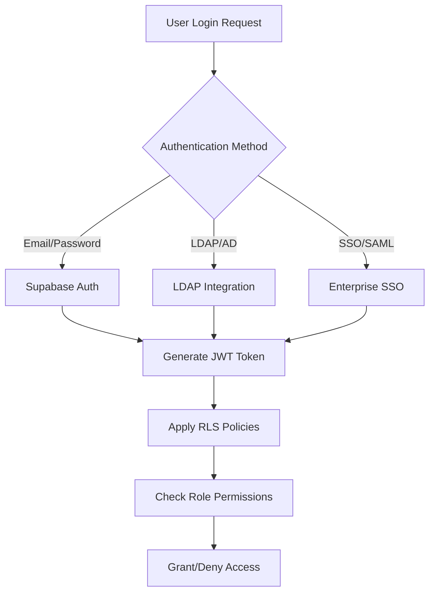
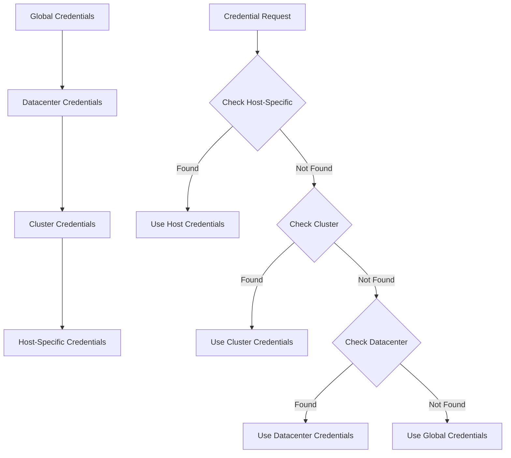
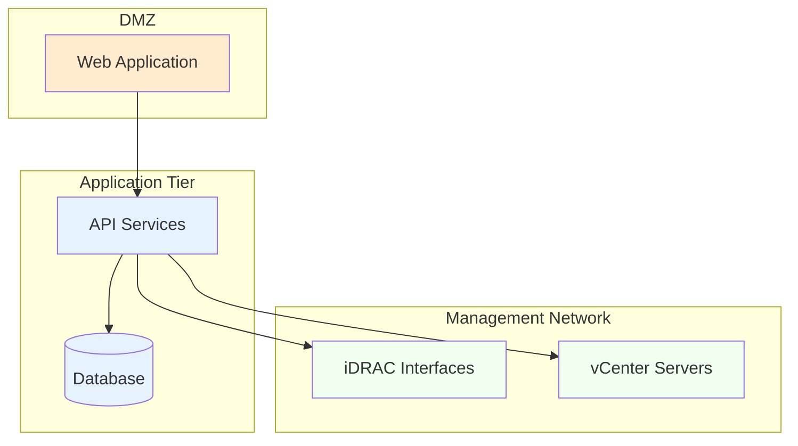
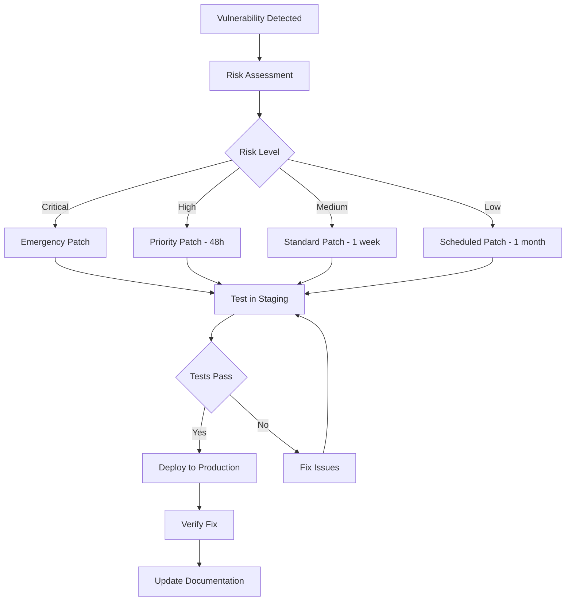
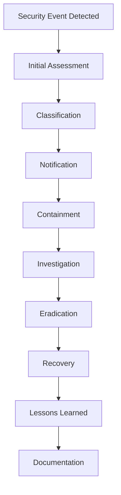

# Security Documentation

## Security Architecture Overview

The iDRAC Updater Orchestrator implements defense-in-depth security with multiple layers of protection across authentication, authorization, data protection, and network security.

## Authentication & Authorization

### Multi-Layer Authentication


### Role-Based Access Control (RBAC)

#### User Roles
| Role | Permissions | Description |
|------|-------------|-------------|
| **Super Admin** | Full system access | Complete administrative control |
| **Infrastructure Admin** | Server and update management | Datacenter operations |
| **Security Admin** | Security and compliance management | Audit and policy enforcement |
| **Operator** | Day-to-day operations | Standard user operations |
| **Read-Only** | View-only access | Monitoring and reporting |

#### Permission Matrix
| Action | Super Admin | Infra Admin | Security Admin | Operator | Read-Only |
|--------|-------------|-------------|----------------|----------|-----------|
| Manage Users | ✅ | ❌ | ✅ | ❌ | ❌ |
| Configure vCenter | ✅ | ✅ | ❌ | ❌ | ❌ |
| Execute Updates | ✅ | ✅ | ❌ | ✅ | ❌ |
| View Audit Logs | ✅ | ✅ | ✅ | ❌ | ❌ |
| Emergency Override | ✅ | ✅ | ❌ | ❌ | ❌ |

### Row Level Security (RLS) Policies

#### Host Access Control
```sql
-- Users can only see hosts in their assigned datacenters
CREATE POLICY "datacenter_access" ON hosts
FOR SELECT USING (
    auth.uid() IN (
        SELECT user_id FROM user_datacenter_access 
        WHERE datacenter_id = hosts.datacenter_id
    ) OR
    auth.jwt() ->> 'role' = 'super_admin'
);

-- Update operations require infrastructure permissions
CREATE POLICY "infrastructure_updates" ON hosts
FOR UPDATE USING (
    auth.jwt() ->> 'role' IN ('super_admin', 'infrastructure_admin')
);
```

#### Credential Protection
```sql
-- Credentials are only accessible to authorized users
CREATE POLICY "credential_access" ON credentials
FOR ALL USING (
    -- Admin users can access all credentials
    auth.jwt() ->> 'role' IN ('super_admin', 'infrastructure_admin') OR
    -- Users can access credentials for their assigned hosts
    host_id IN (
        SELECT id FROM hosts WHERE datacenter_id IN (
            SELECT datacenter_id FROM user_datacenter_access 
            WHERE user_id = auth.uid()
        )
    )
);
```

## Data Protection

### Encryption at Rest
- **Database**: AES-256 encryption for all data at rest
- **Credentials**: Additional application-layer encryption using Supabase Vault
- **Firmware Files**: Encrypted storage with integrity verification
- **Backup Data**: Encrypted backups with secure key management

### Encryption in Transit
- **API Communications**: TLS 1.3 for all HTTP/HTTPS traffic
- **Database Connections**: SSL/TLS encrypted connections
- **Real-time Subscriptions**: WebSocket Secure (WSS) connections
- **iDRAC Communications**: TLS with certificate validation

### Credential Management

#### Hierarchical Credential Storage


#### Credential Vault Integration
```typescript
// Secure credential storage using Supabase Vault
const storeCredential = async (hostId: string, credentials: Credentials) => {
  // Encrypt credentials before storage
  const encrypted = await vault.encrypt(credentials);
  
  // Store with access control
  await supabase.from('credentials').insert({
    host_id: hostId,
    kind: credentials.type,
    vault_path: encrypted.path,
    created_by: user.id
  });
};

// Secure credential retrieval
const getCredential = async (hostId: string, type: string) => {
  // Check permissions via RLS
  const { data } = await supabase
    .from('credentials')
    .select('vault_path')
    .eq('host_id', hostId)
    .eq('kind', type)
    .single();
    
  // Decrypt and return
  return await vault.decrypt(data.vault_path);
};
```

## Network Security

### Network Segmentation


### Firewall Rules
| Source | Destination | Port | Protocol | Purpose |
|--------|-------------|------|----------|---------|
| Web Clients | Web App | 443 | HTTPS | User interface |
| Web App | API | 8081 | HTTPS | API calls |
| API | Database | 5432 | PostgreSQL | Database access |
| API | iDRAC | 443 | HTTPS | Redfish API |
| API | vCenter | 443 | HTTPS | vCenter API |

### Certificate Management
- **Web Application**: Valid TLS certificates with automated renewal
- **API Endpoints**: Mutual TLS authentication for service-to-service
- **iDRAC Connections**: Certificate validation with custom CA support
- **Internal Communications**: Self-signed certificates with proper validation

## Audit & Compliance

### Comprehensive Audit Trail
```sql
-- System events table captures all security-relevant activities
CREATE TABLE system_events (
    id UUID PRIMARY KEY DEFAULT gen_random_uuid(),
    event_type TEXT NOT NULL,
    severity TEXT NOT NULL,
    user_id UUID REFERENCES auth.users(id),
    resource_type TEXT,
    resource_id UUID,
    action TEXT NOT NULL,
    details JSONB DEFAULT '{}',
    ip_address INET,
    user_agent TEXT,
    session_id TEXT,
    created_at TIMESTAMPTZ DEFAULT now()
);

-- Trigger for automatic audit logging
CREATE OR REPLACE FUNCTION log_security_event()
RETURNS TRIGGER AS $$
BEGIN
    INSERT INTO system_events (
        event_type,
        severity,
        user_id,
        resource_type,
        resource_id,
        action,
        details,
        ip_address
    ) VALUES (
        TG_TABLE_NAME || '_' || TG_OP,
        'info',
        auth.uid(),
        TG_TABLE_NAME,
        COALESCE(NEW.id, OLD.id),
        TG_OP,
        CASE
            WHEN TG_OP = 'DELETE' THEN to_jsonb(OLD)
            ELSE to_jsonb(NEW)
        END,
        inet_client_addr()
    );
    RETURN COALESCE(NEW, OLD);
END;
$$ LANGUAGE plpgsql;
```

### Compliance Frameworks

#### SOC 2 Type II Compliance
- **Security**: Multi-factor authentication and access controls
- **Availability**: High availability and disaster recovery
- **Processing Integrity**: Data validation and integrity checks
- **Confidentiality**: Encryption and access restrictions
- **Privacy**: Data handling and retention policies

#### ISO 27001 Controls
- **A.9** Access Control Management
- **A.10** Cryptography
- **A.12** Operations Security
- **A.13** Communications Security
- **A.14** System Acquisition and Development

### Security Monitoring

#### Real-time Security Alerts
```typescript
// Security event monitoring
const monitorSecurityEvents = () => {
  supabase
    .channel('security_events')
    .on('postgres_changes', {
      event: 'INSERT',
      schema: 'public',
      table: 'system_events',
      filter: 'severity=eq.critical'
    }, (payload) => {
      // Immediate alert for critical security events
      sendSecurityAlert(payload.new);
    })
    .subscribe();
};

// Anomaly detection
const detectAnomalies = async () => {
  const suspiciousEvents = await supabase
    .from('system_events')
    .select('*')
    .gte('created_at', new Date(Date.now() - 3600000)) // Last hour
    .in('event_type', ['failed_login', 'permission_denied', 'unauthorized_access'])
    .gte('count', 5); // More than 5 attempts
    
  if (suspiciousEvents.data?.length) {
    await triggerSecurityInvestigation(suspiciousEvents.data);
  }
};
```

## Vulnerability Management

### Security Scanning
- **Static Code Analysis**: Automated code vulnerability scanning
- **Dependency Scanning**: Third-party library vulnerability detection
- **Container Scanning**: Docker image security assessment
- **Infrastructure Scanning**: Cloud resource security validation

### Penetration Testing
- **Quarterly External Testing**: Third-party security assessment
- **Internal Security Reviews**: Regular internal vulnerability assessments
- **Red Team Exercises**: Simulated attack scenarios
- **Bug Bounty Program**: Community-driven vulnerability discovery

### Patch Management


## Incident Response

### Security Incident Classification
| Level | Description | Response Time | Stakeholders |
|-------|-------------|---------------|--------------|
| **Critical** | Active security breach | 15 minutes | All teams + executives |
| **High** | Potential security threat | 1 hour | Security + affected teams |
| **Medium** | Security policy violation | 4 hours | Security team |
| **Low** | Minor security concern | 24 hours | System administrators |

### Incident Response Workflow


### Forensic Capabilities
- **Log Retention**: 90-day minimum log retention for analysis
- **Immutable Logs**: Write-once log storage for integrity
- **Chain of Custody**: Proper evidence handling procedures
- **Timeline Reconstruction**: Detailed incident timeline creation

## Security Best Practices

### Development Security
- **Secure Coding Standards**: OWASP guidelines implementation
- **Code Review Process**: Security-focused peer reviews
- **Threat Modeling**: Security threat analysis during design
- **Security Testing**: Automated security test integration

### Operational Security
- **Principle of Least Privilege**: Minimal required access rights
- **Defense in Depth**: Multiple security layer implementation
- **Regular Security Training**: Ongoing team education
- **Security Awareness**: User security training programs

### Configuration Security
```typescript
// Security configuration validation
const validateSecurityConfig = () => {
  const securityChecks = [
    checkPasswordComplexity(),
    validateTLSConfiguration(),
    verifyEncryptionSettings(),
    auditUserPermissions(),
    validateNetworkPolicies()
  ];
  
  return Promise.all(securityChecks);
};

// Automated security hardening
const hardenSystem = async () => {
  await enforcePasswordPolicy();
  await enableAuditLogging();
  await configureFirewallRules();
  await updateSecurityHeaders();
  await validateCertificates();
};
```

This comprehensive security framework ensures the iDRAC Updater Orchestrator maintains enterprise-grade security across all components and operations.